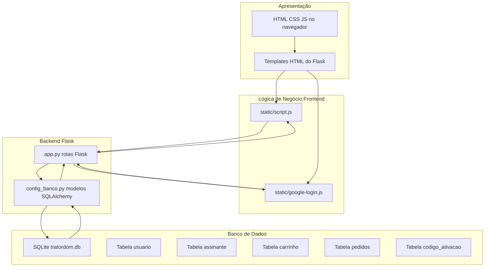
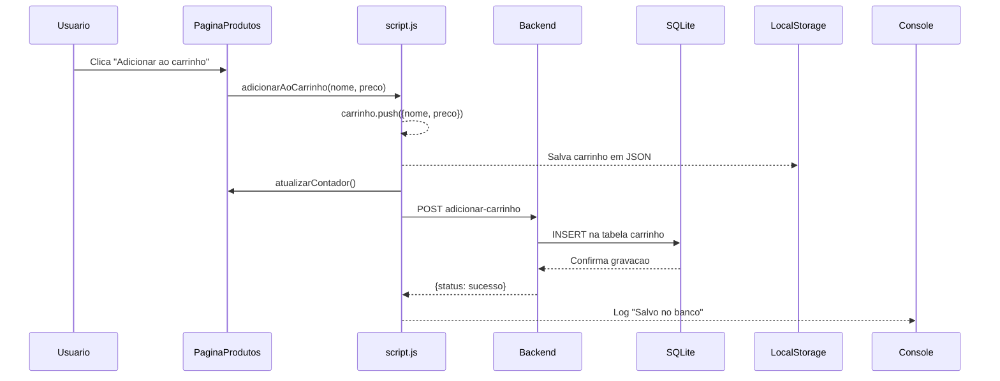
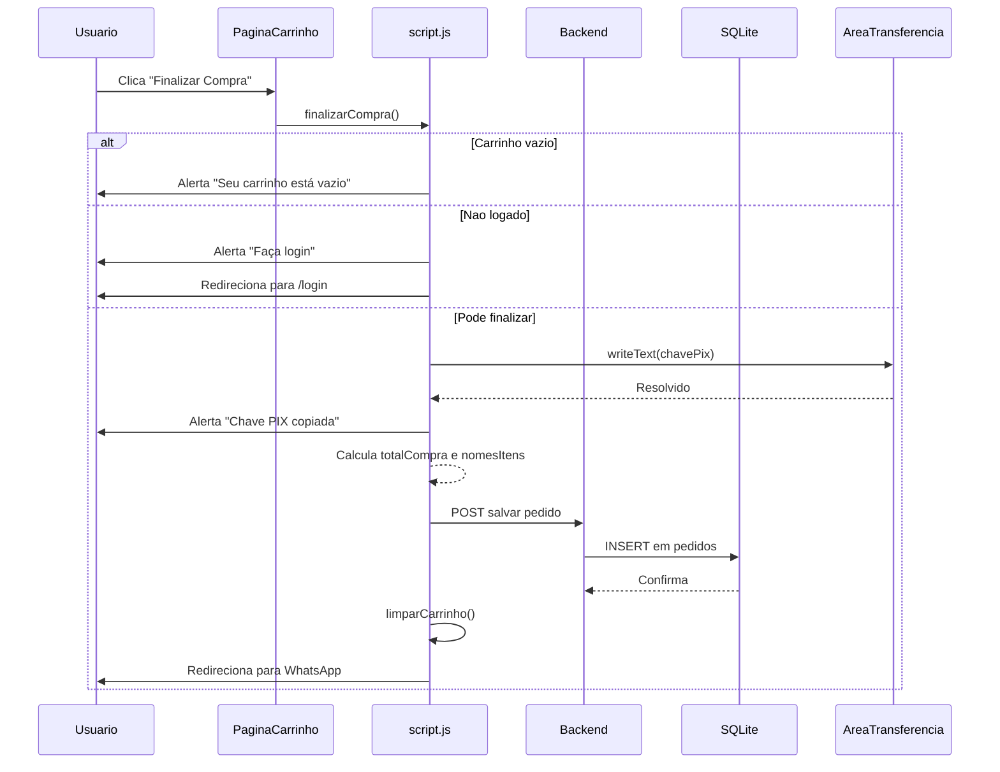
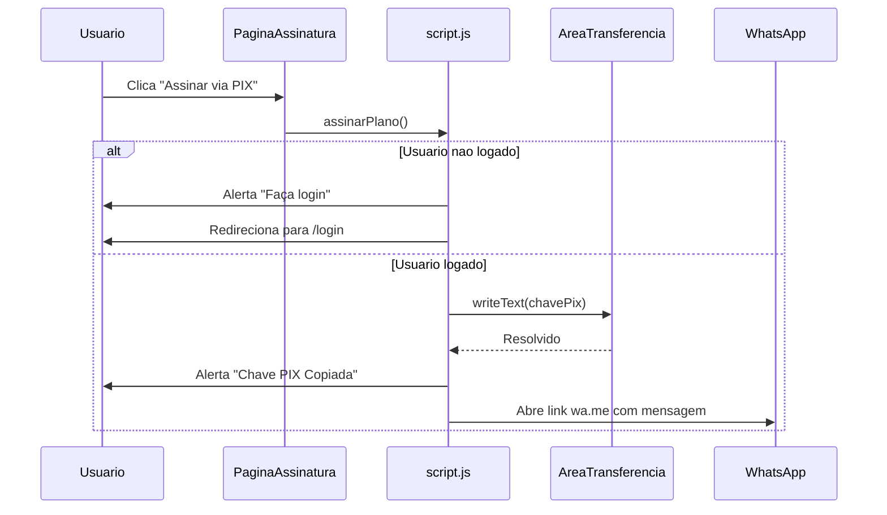
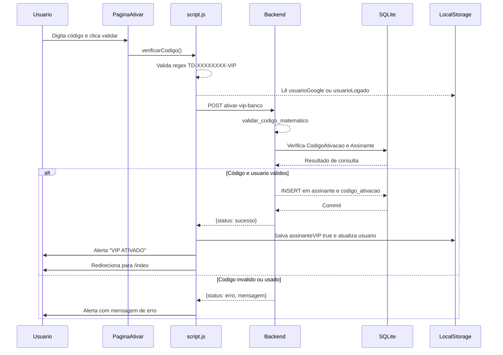
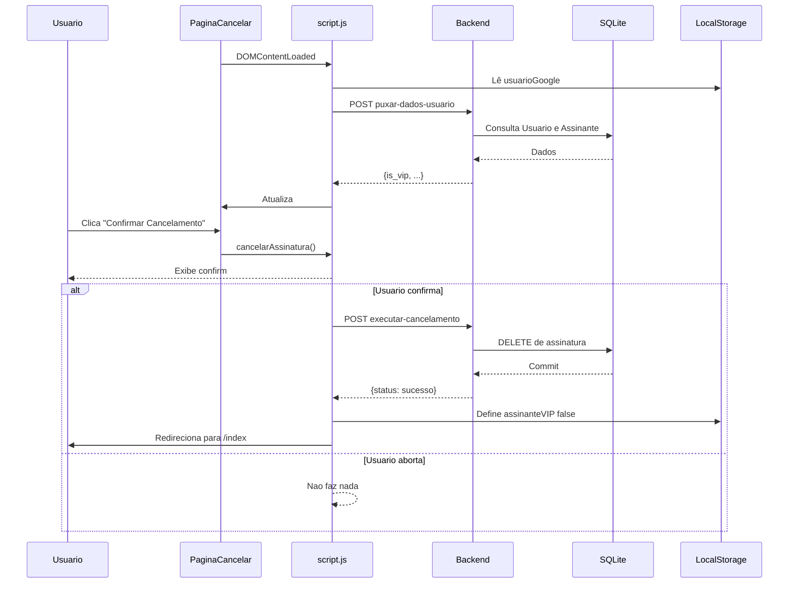

# Tratordom – Documentação de Funcionalidades

## Overview

A plataforma Tratordom integra catálogo de produtos, carrinho de compras e planos VIP em um único ambiente.  
Ela oferece login via Google, interações em tempo real, persistência de dados no servidor e marca visual temática agrícola.  
O backend em Flask expõe APIs REST que o frontend consome por meio de JavaScript para sincronizar carrinho, pedidos e assinaturas.  
Todas as páginas HTML consomem os mesmos estilos globais, garantindo identidade visual consistente em todo o e‑commerce.

## Architecture Overview



## Component Structure

### 1. Presentation Layer

Esta camada contém todas as páginas HTML e estilos CSS usados diretamente pelo usuário no navegador.  
Ela organiza a navegação, exibe produtos, formulário de contato, login Google, carrinho e telas de assinatura VIP.  
Os arquivos HTML fazem referência a arquivos CSS e JS dentro de `static/` e aos endpoints do Flask por caminho de rota.

#### **Páginas HTML** (`*.html`)

- **index.html**  
  - Página inicial acessível por `/` e `/index` via Flask.  
  - Mostra logotipo, cabeçalho com links para Produtos, Contatos, Assinatura VIP, Carrinho e área de usuário (`#usuario-container`).  
  - Possui seção `#boas-vindas` com título, texto de apresentação e botão "Ver Catálogo de Produtos".  
  - Inclui script que tenta fazer `fetch('http://127.0.0.1:5000')` e loga `data.status` em caso de resposta JSON.

- **produtos.html**  
  - Exibe a lista de produtos em um `section` com id `#lista-produtos` e título "Produtos em Destaque".  
  - A grade de produtos usa a classe `.grid-produtos`, com cada item em `.produto` contendo imagem, nome, preço e botão.  
  - Cada botão chama `adicionarAoCarrinho(nome, preco)` com nome e preço em reais, por exemplo `115500` para o Trator.  
  - O cabeçalho inclui link do carrinho com contador `<span id="contador">0</span>` que o JavaScript atualiza.

- **contatos.html**  
  - Página de informações de contato com seção `#informacoes`, que apresenta e‑mail, telefone, WhatsApp e endereço.  
  - Inclui formulário de contato em `#formulario` que envia via POST para o Formspree (`https://formspree.io/f/xvzrqqpr`).  
  - Contém iframe do Google Maps em `#mapa`, com mapa incorporado e parâmetros de localização estáticos.  
  - Usa os estilos globais (`style.css`), de contatos (`contatos.css`) e de cabeçalho (`header.css`).

- **login.html**  
  - Exibe um contêiner `#login-container` com título "Login com Google" e texto explicativo.  
  - Dentro de `.google-wrapper` há um elemento `.g_id_signin` que o script do Google preenche com o botão de login.  
  - O script do Google é carregado com `<script src="https://accounts.google.com/gsi/client" async defer></script>`.  
  - A div `#g_id_onload` define o `data-client_id` e `data-callback="handleCredentialResponse"`, ligando ao `google-login.js`.

- **assinatura.html**  
  - Página de venda da assinatura VIP, com seção `#plano-vip` que contém um único card `.card-assinatura`.  
  - O card exibe badge `.badge-vip` "Plano Logística Premium", título "Entrega Prioritária" e um parágrafo de descrição.  
  - A área de valor usa `.valor-mensal`, `.moeda`, `.preco` e `.periodo` para destacar o preço "R$ 12,00 /mês".  
  - A lista `.beneficios` mostra quatro itens, e o botão `.btn-assinar` chama `assinarPlano()` definido em `script.js`.  
  - O rodapé repete o texto de direitos reservados igual a outras páginas.

- **ativar.html**  
  - Tela centralizada de ativação de assinatura, com `main` usando flexbox inline (`display: flex`, `min-height: 70vh`).  
  - A seção `#area-ativacao` contém título, instruções, campo de texto `#codigo-vip` e botão que chama `verificarCodigo()`.  
  - O texto final sugere ir para `/assinatura` se o usuário ainda não possuir o código VIP.  
  - Carrega `static/script.js` e `static/google-login.js` para validar código e preencher informações de usuário no header.

- **carrinho.html**  
  - Contém seção `#carrinho` com lista `<ul id="lista-carrinho">` e um item inicial "O carrinho está vazio".  
  - Exibe o parágrafo `#total` com formato "Total: R$ 0,00", atualizado pelo JavaScript em tempo real.  
  - A div `.carrinho-botoes` possui dois botões: `limparCarrinho()` e `finalizarCompra()`.  
  - Inclui rodapé padrão e importa `static/script.js` para gerenciar o carrinho e o total.

- **cancelar.html**  
  - Tela de gerenciamento da assinatura com `#area-ativacao` reaproveitado como card central.  
  - Mostra `#status-atual` com texto inicial "Verificando status da sua assinatura...".  
  - O botão `#btn-confirmar-cancelar` chama `cancelarAssinatura()` e inicia oculto (`style="display: none"`).  
  - O script em `static/script.js` atualiza status e visibilidade do botão com base em `data.is_vip` vindo do backend.

- **painel-adm.html**  
  - Página administrativa com estilo inline e painel `.painel` centralizado na viewport.  
  - Exibe `<div id="resultado">TD-XXXXXXXX-VIP</div>` contendo o código gerado.  
  - O botão "GERAR NOVO CÓDIGO" aciona `gerarCodigo()` que cria códigos compatíveis com a validação matemática do backend.  
  - Um IIFE (função autoexecutável) pede senha `"SENHA123"` via `prompt` e redireciona para `/index` se a senha estiver errada.  
  - A função `mostrarNotificacao` cria um "toast" visual com mensagem de acesso autorizado.  

#### **Estilos CSS** (`static/style.css` e `static/stylecss/*.css`)

- **style.css**  
  - Define variáveis CSS globais no `:root` para cores principais, como `--primary-green`, `--accent-pink` e `--accent-blue`.  
  - Estiliza o `body` com imagem de fundo fixa (`imagens/fundo.png`), tipografia padrão e `line-height: 1.6`.  
  - Configura seções principais (`#carrinho`, `#informacoes`, `#formulario`, `#mapa`, `#lista-produtos`, `#login`) com o mesmo card visual.  
  - Estiliza títulos `h2` com linha de destaque via `::after`, botão `.btn-principal`, formulário de contato e botão submit padrão.  
  - Define estilos para login com Google (`#google-btn` e `#user-info`), rodapé, scrollbars personalizados e indicadores visuais VIP: `.badge-vip`, `.user-foto-vip`, `.nome-vip`.  

- **header.css**  
  - `header` usa `display: flex`, `justify-content: space-between` e `position: sticky` com `top: 0` e `z-index: 1000`.  
  - Estiliza o título `h1` com cor `var(--accent-pink)`, `text-transform: uppercase` e `text-shadow`.  
  - Os links de navegação (`header nav a`) têm espaçamento, transição e `:hover` com fundo semi-transparente.  
  - O link `#ver-carrinho` recebe destaque com fundo `var(--accent-pink)` e `:hover` com transformação `translateY(-2px)`.

- **produtos.css**  
  - `.grid-produtos` cria um grid responsivo com `repeat(auto-fit, minmax(280px, 1fr))` e `gap: 30px`.  
  - `.produto` define cards com `border-radius: 12px`, `box-shadow` em `:hover` e limites de largura centralizados.  
  - As imagens têm `object-fit: cover`, altura fixa de 200px e `border-radius: 8px`.  
  - O preço em `.produto p` usa cor `#ffd54f` e fonte maior e em negrito; o botão herda cor rosa (`var(--accent-pink)`).  

- **carrinho.css**  
  - Remove marcadores da lista em `#carrinho ul` e aplica padding zero.  
  - Cada item `#carrinho li` usa `display: flex`, `justify-content: space-between` e `align-items: center`.  
  - `#total` mostra o preço total com `font-size: 1.5rem`, cor amarela `#ffd54f` e alinhamento à direita.  
  - `.carrinho-botoes` organiza os botões em linha com `display: flex`, `gap: 10px` e centralização.  
  - `.remover-produto` é o "X" vermelho com `font-size: 1.6rem`, `:hover` com `transform: scale(1.3)` e mudança de cor.

- **contatos.css**  
  - `#informacoes p` organiza o conteúdo em flex, com `align-items: center`, `gap: 10px` e `flex-wrap: wrap`.  
  - Links dentro de `#informacoes a` usam `color: var(--accent-blue)` e `:hover` com `text-decoration: underline`.  

- **assinatura.css**  
  - `#plano-vip` centraliza o cartão de assinatura com `display: flex` e `justify-content: center`.  
  - `.card-assinatura` é um card com fundo `var(--card-bg)`, borda azul, `border-radius: 15px` e `box-shadow` forte.  
  - `.badge-vip` é posicionada com `position: absolute`, central na parte superior do card.  
  - `.valor-mensal` destaca o preço com `font-size: 3rem` na classe `.preco` e cor `#ffd54f`.  
  - `.beneficios` remove marcadores, alinha texto à esquerda e separa itens com `margin: 10px 0`.  
  - `.btn-assinar` é um botão em largura total, com `transition: transform 0.2s` e `:hover` que aumenta levemente.  
  - `#area-ativacao` define o card de ativação, reutilizado em `ativar.html` e `cancelar.html`, com `box-shadow` e `max-width: 1000px`.  
  - `#codigo-vip` estabelece input centralizado, `text-transform: uppercase` e borda que muda cor no `:focus`.  
  - O botão de `#area-ativacao` replica o estilo de botões principais azuis (`var(--accent-blue)`).

- **cancelar.css**  
  - Aplica animação `fadeIn` a `#area-ativacao` com `opacity` e `translateY` ajustados em `@keyframes`.  
  - `#status-atual` usa fundo semi-transparente, borda leve e `font-weight: bold`.  
  - `#btn-confirmar-cancelar` define botão rosa com animação de `:hover` e `:active` que escalona tamanho.  
  - `.link-home` estiliza o link de retorno como botão com borda azul e `:hover` invertendo cores.

- **login.css**  
  - `#login-container` configura o card de login com borda grossa (`border: 10px solid rgba(255,255,255,0.1)`).  
  - `.g_id_signin` e `.google-wrapper` garantem que o botão Google ocupe largura total e tenha `border-radius: 60px`.  
  - `.user-info` no login mostra a foto `.user-foto`, nome `.user-nome` e botão `.btn-logout` em um "pill" central.  
  - Estilos específicos para `#usuario-container .user-info`, `.btn-logout` e `.btn-login-header` controlam a exibição no header.  
  - Media query em `@media (max-width: 768px)` ajusta padding e empilha `.user-info` verticalmente.

#### **Scripts JS** (`static/script.js` e `static/google-login.js`)

- **script.js**  
  - Implementa toda a lógica de carrinho, finalização de compra, fluxo de assinatura VIP e sincronização com o backend.  
  - Usa `localStorage` para `carrinho`, `usuarioGoogle`, `usuarioLogado` (alternativo) e `assinanteVIP`.  
  - Faz chamadas `fetch` para múltiplos endpoints Flask, sempre com JSON no corpo e cabeçalho `'Content-Type': 'application/json'`.  
  - Possui listener `DOMContentLoaded` que inicializa contadores, carrinho renderizado e status de assinatura em qualquer página.

- **google-login.js**  
  - Define `handleCredentialResponse(response)` chamado pelo Google após autenticação.  
  - Faz `parseJwt(token)` manualmente para extrair `name`, `email` e `picture` do token JWT.  
  - Realiza `fetch` para `/login-google`, persiste `usuarioGoogle` com `id` do banco e `assinanteVIP`, e chama `atualizarUsuarioHeader()`.  
  - Implementa `logoutGoogleUser()` e `atualizarUsuarioHeader()`, atualizando dinamicamente o conteúdo de `#usuario-container`.  
  - Adiciona listener `DOMContentLoaded` para chamar `atualizarUsuarioHeader` em qualquer página.

---

### 2. Business Logic

Esta camada reúne as funções JavaScript que aplicam regras de negócio no frontend.  
Elas coordenam entre o estado do navegador (localStorage), DOM e chamadas à API Flask.  
Todas as funções em `script.js` assumem que alguns elementos HTML existem somente em páginas específicas, e verificam isso quando necessário.

#### **script.js** (`static/script.js`)

- **Variável global de carrinho**

  - Inicialização:

    ```js
    let carrinho = JSON.parse(localStorage.getItem('carrinho')) || [];
    ```

  - Mantém um array de objetos com a forma `{ nome, preco }`.  
  - Reflete sempre o conteúdo persistido em `localStorage` pela mesma chave.

- **Função `adicionarAoCarrinho(nome, preco)`**

  - Parâmetros:  
    - `nome`: string do nome do produto.  
    - `preco`: número representando o preço em reais.  
  - Ações:  
    - Faz `carrinho.push({ nome, preco })`.  
    - Salva o array atualizado em `localStorage` (`setItem('carrinho', JSON.stringify(carrinho))`).  
    - Chama `atualizarContador()` para refletir o novo número de itens no header.  
    - Lê `usuarioGoogle` do `localStorage` e, se existir com `id`, faz `fetch` para `http://localhost:5000/adicionar-carrinho`.  
    - Envia JSON com `{ usuario_id, produto_nome: nome, preco }` para salvar o item no banco via modelo `Carrinho`.  
    - Loga sucesso no console (`"Salvo no banco:"`) ou erro em caso de falha de rede.

- **Função `atualizarContador()`**

  - Obtém elemento `#contador` via `document.getElementById`.  
  - Se existir, define `innerText` para o comprimento do array `carrinho`.  
  - É chamada em inicialização, adição, remoção e limpeza do carrinho.

- **Função `renderizarCarrinho()`**

  - Obtém `#lista-carrinho` e `#total` e retorna imediatamente se `lista` não existir (páginas sem lista).  
  - Limpa o conteúdo atual da lista (`lista.innerHTML = ''`) e inicializa `total = 0`.  
  - Para cada item, cria `<li>` e preenche com nome, preço formatado em PT-BR e um `<span>` `.remover-produto` com `onclick="removerDoCarrinho(index)"`.  
  - Atualiza o acumulador `total` somando `item.preco` e, ao final, formata `#total` como "Total: R$ xx,xx".

- **Função `removerDoCarrinho(index)`**

  - Recebe o índice do item no array `carrinho`.  
  - Guarda `itemRemovido` antes de remover para usar seu nome na requisição ao backend.  
  - Remove item com `carrinho.splice(index, 1)` e atualiza `localStorage`.  
  - Chama `renderizarCarrinho()` e `atualizarContador()` para refletir mudanças.  
  - Se `usuarioGoogle` existir, envia POST para `http://localhost:5000/remover-item-carrinho` com `{ usuario_id, produto_nome: itemRemovido.nome }`.  
  - Exibe no console a mensagem vinda do backend ou erro em caso de falha.

- **Função `limparCarrinho()`**

  - Retorna imediatamente se `carrinho.length === 0`.  
  - Exibe `confirm("Deseja realmente esvaziar todo o seu carrinho?")` para o usuário.  
  - Se confirmado, zera o array (`carrinho = []`), atualiza `localStorage`, chama `renderizarCarrinho()` e `atualizarContador()`.  
  - Se `usuarioGoogle` existir, faz POST para `http://localhost:5000/limpar-carrinho-banco` com `{ usuario_id }`.  
  - Loga "Servidor:" e a mensagem do backend, ou erro em caso de problema de rede.

- **Função `finalizarCompra()`**

  - Verifica se `carrinho.length === 0`; se for, mostra notificação via `mostrarNotificacao` (se existir) ou `alert` e retorna.  
  - Lê `usuarioGoogle` do `localStorage`; se não existir, pede login e redireciona para `/login` após `setTimeout` de 2 segundos.  
  - Define uma string estática `chavePix = "SUA-CHAVE-PIX-AQUI"`.  
  - Usa `navigator.clipboard.writeText(chavePix)` e, em `then`, mostra `alert` avisando que a chave PIX foi copiada.  
  - Calcula `totalCompra` com `reduce` e gera `nomesItens` juntando os nomes com `join(", ")`.  
  - Faz `fetch('http://localhost:5000/salvar-pedido', {...})` enviando `{ usuario_id, itens: nomesItens, total: totalCompra }` sem tratar a resposta.  
  - Chama `limparCarrinho()` para limpar carrinho local (e banco, via função).  
  - Por fim, redireciona o usuário para o WhatsApp em `"https://wa.me/5511999999999"`.

- **Função `assinarPlano()`**

  - Lê `usuarioGoogle` do `localStorage`.  
  - Se não existir, faz `alert("Faça login para assinar o Plano VIP!")` e redireciona para `"login"`.  
  - Define `chavePix` e `foneWhatsApp` como strings estáticas.  
  - Monta mensagem `msg` com nome e e‑mail do usuário e texto de confirmação do PIX de R$ 12,00.  
  - Copia a chave PIX para a área de transferência com `navigator.clipboard.writeText` e, em seguida, mostra `alert` com chave copiada.  
  - Redireciona para URL do WhatsApp com `?text=` contendo a mensagem codificada (`encodeURIComponent`).

- **Função assíncrona `verificarCodigo()`**

  - Obtém `#codigo-vip` e retorna se o elemento não existir.  
  - Lê o valor, faz `trim()` e `toUpperCase()`, garantindo letras maiúsculas.  
  - Valida o formato com regex `^TD-\d{8}-VIP$`; se não combinar, exibe `alert` com mensagem de formato inválido.  
  - Lê `usuarioLogado` ou `usuarioGoogle` do `localStorage` e verifica se possui `id`.  
  - Envia POST para `'/ativar-vip-banco'` com `{ codigo, usuario_id }`.  
  - Interpreta `response.json()` e, em caso de `response.ok`, marca `assinanteVIP` como `'true'` em `localStorage`.  
  - Atualiza também o objeto de usuário (`usuario.assinante = true`) e o regrava como `usuarioGoogle` ou `usuarioLogado`.  
  - Exibe `alert("✅ VIP ATIVADO COM SUCESSO!")` e redireciona para `"index"`.  
  - Se a resposta não for `ok`, exibe `alert("❌ " + data.mensagem)`.  
  - Em qualquer erro de rede, loga `"Erro na comunicação:"` e mostra alerta de falha de conexão.

- **Função `verificarStatusAssinante()`**

  - Lê `assinanteVIP` do `localStorage` e compara se é `'true'`.  
  - Obtém elemento `#total` e confere se ainda não existe um `.aviso-vip` na página.  
  - Se for VIP, cria `<p>` com classe `"aviso-vip"`, cor `gold` e texto `"🚀 Entrega Prioritária Ativada!"`.  
  - Insere o parágrafo logo após o elemento `#total` usando `totalElem.after(aviso)`.

- **Função `cancelarAssinatura()`**

  - Lê `usuarioGoogle` de `localStorage`.  
  - Exibe `confirm("Confirmar o cancelamento do seu plano VIP?")`; se o usuário cancelar, a função retorna sem fazer nada.  
  - Em caso afirmativo, envia POST para `http://localhost:5000/executar-cancelamento` com `{ email: usuario.email }`.  
  - Ao receber JSON, se `data.status === "sucesso"`, define `localStorage.assinanteVIP = 'false'` e redireciona para `"index"`.  

- **Bloco `DOMContentLoaded` em `script.js`**

  - Executa em todas as páginas que importam `static/script.js`.  
  - Lê `usuarioGoogle` do `localStorage`; se existir com `email`, chama `atualizarUsuarioHeader()` se a função estiver definida.  
  - Em seguida, envia POST para `http://localhost:5000/puxar-dados-usuario` com `{ email: usuarioLocal.email, nome: usuarioLocal.nome }`.  
  - Quando a resposta chega:  
    - Atualiza `assinanteVIP` com `data.is_vip ? 'true' : 'false'`.  
    - Se `data.carrinho` existir, sobrescreve o array global `carrinho` e salva em `localStorage`.  
    - Chama `atualizarContador()`, `renderizarCarrinho()` (se `#lista-carrinho` existir) e `verificarStatusAssinante()`.  
    - Atualiza textos e visibilidade em `cancelar.html`: `#status-atual` recebe `"Status: VIP Ativo ★"` ou `"Status: Plano Gratuito"`, e `#btn-confirmar-cancelar` é exibido apenas se VIP.  
    - Loga no console `"Sincronização Completa! Pedidos:"` com `data.pedidos`.  
  - Se não houver `usuarioGoogle`, apenas garante que `atualizarContador()` e `renderizarCarrinho()` funcionem com dados locais.

---

### 3. Data Access Layer

Esta camada é composta pelos endpoints do Flask definidos em `app.py` e pelos modelos SQLAlchemy declarados em `config_banco.py`.  
As funções do frontend se comunicam com essas rotas usando `fetch` e JSON, enquanto o Flask manipula os modelos e o SQLite.  
As rotas estão organizadas em rotas de páginas HTML e rotas de API de negócio.

---

### 4. Data Models

Os modelos SQLAlchemy representam diretamente as tabelas encontradas no arquivo `tratordom.db`.  
Cada classe possui colunas com tipos e restrições que refletem as necessidades do e‑commerce, como unicidade de e‑mail e relacionamento entre usuário e carrinho.

#### **Modelo `Usuario`** (`config_banco.py`)

```python
class Usuario(db.Model):
    id = db.Column(db.Integer, primary_key=True)
    nome = db.Column(db.String(100), nullable=False)
    email = db.Column(db.String(100), unique=True, nullable=False)

    assinatura_ref = db.relationship('Assinante', backref='usuario_base', uselist=False)
    carrinho_ref = db.relationship('Carrinho', backref='usuario_base')
```

- Representa qualquer usuário que efetue login pela primeira vez no sistema.  
- Usa `email` como chave única (`unique=True`) para evitar duplicações.  
- Define relacionamentos com `Assinante` (um‑para‑um) e `Carrinho` (um‑para‑muitos) para facilitar consultas no Python.

#### **Modelo `Assinante`** (`config_banco.py`)

```python
class Assinante(db.Model):
    id = db.Column(db.Integer, primary_key=True)
    usuario_id = db.Column(db.Integer, db.ForeignKey('usuario.id'), nullable=False)
    plano = db.Column(db.String(50), default='Vip')
    status = db.Column(db.String(20), default='Ativo')
```

- Representa usuários que possuem assinatura ativa.  
- Usa `usuario_id` como chave estrangeira para `usuario.id`.  
- Armazena tipo de plano (`plano`) e `status` textual da assinatura.

#### **Modelo `Carrinho`** (`config_banco.py`)

```python
class Carrinho(db.Model):
    id = db.Column(db.Integer, primary_key=True)
    usuario_id = db.Column(db.Integer, db.ForeignKey('usuario.id'), nullable=False)
    produto_nome = db.Column(db.String(100), nullable=False)
    preco = db.Column(db.Float, nullable=False)
    quantidade = db.Column(db.Integer, default=1)
```

- Guarda itens adicionados ao carrinho de um usuário específico.  
- `produto_nome` registra o nome do produto exibido na interface.  
- `preco` contém o valor em ponto flutuante, e `quantidade` registra contagem (o frontend atual sempre envia 1).

#### **Modelo `Pedidos`** (`config_banco.py`)

```python
class Pedidos(db.Model):
    id = db.Column(db.Integer, primary_key=True)
    usuario_id = db.Column(db.Integer, db.ForeignKey('usuario.id'), nullable=False)
    itens = db.Column(db.Text, nullable=False)
    total = db.Column(db.Float, nullable=False)
    data_criacao = db.Column(db.DateTime, default=datetime.utcnow)

    def esta_expirado(self):
        return datetime.utcnow() > self.data_criacao + timedelta(days=30)
```

- Registra pedidos finalizados com itens concatenados em texto e valor total.  
- `data_criacao` usa `datetime.utcnow` como padrão.  
- O método `esta_expirado` calcula se o pedido possui mais de 30 dias.

#### **Modelo `CodigoAtivacao`** (`config_banco.py`)

```python
class CodigoAtivacao(db.Model):
    id = db.Column(db.Integer, primary_key=True)
    codigo = db.Column(db.String(30), unique=True, nullable=False)
    usuario_id = db.Column(db.Integer, db.ForeignKey('usuario.id'), nullable=False)
```

- Mantém registro de todos os códigos de ativação já utilizados.  
- `codigo` é único no banco, impedindo reutilização de códigos.  
- `usuario_id` relaciona o código ao usuário que ativou o VIP.

---

### 5. API Integration

Os endpoints abaixo estão implementados em `app.py` e são usados diretamente pelo frontend.  
Cada endpoint possui seu próprio bloco de documentação em formato JSON interativo.

#### POST `/login-google`

```api
{
    "title": "Login Google",
    "description": "Registra ou autentica usuário via Google e retorna status VIP.",
    "method": "POST",
    "baseUrl": "http://localhost:5000",
    "endpoint": "/login-google",
    "headers": [
        {
            "key": "Content-Type",
            "value": "application/json",
            "required": true
        }
    ],
    "queryParams": [],
    "pathParams": [],
    "bodyType": "json",
    "requestBody": "{\n  \"nome\": \"João Silva\",\n  \"email\": \"joao@exemplo.com\",\n  \"foto\": \"https://example.com/foto.jpg\"\n}",
    "formData": [],
    "responses": {
        "200": {
            "description": "Sucesso no login ou registro. Retorna dados do usuário e flag de VIP.",
            "body": "{\n  \"id\": 1,\n  \"nome\": \"João Silva\",\n  \"email\": \"joao@exemplo.com\",\n  \"status_vip\": false\n}"
        }
    }
}
```

#### POST `/adicionar-carrinho`

```api
{
    "title": "Adicionar ao Carrinho",
    "description": "Adiciona um item ao carrinho do usuário autenticado.",
    "method": "POST",
    "baseUrl": "http://localhost:5000",
    "endpoint": "/adicionar-carrinho",
    "headers": [
        {
            "key": "Content-Type",
            "value": "application/json",
            "required": true
        }
    ],
    "queryParams": [],
    "pathParams": [],
    "bodyType": "json",
    "requestBody": "{\n  \"usuario_id\": 1,\n  \"produto_nome\": \"Sementes de Milho\",\n  \"preco\": 20.0\n}",
    "formData": [],
    "responses": {
        "200": {
            "description": "Item salvo com sucesso na tabela carrinho.",
            "body": "{\n  \"status\": \"sucesso\"\n}"
        }
    }
}
```

#### POST `/executar-cancelamento`

```api
{
    "title": "Cancelar Assinatura VIP",
    "description": "Remove o registro de assinatura do usuário, se existir.",
    "method": "POST",
    "baseUrl": "http://localhost:5000",
    "endpoint": "/executar-cancelamento",
    "headers": [
        {
            "key": "Content-Type",
            "value": "application/json",
            "required": true
        }
    ],
    "queryParams": [],
    "pathParams": [],
    "bodyType": "json",
    "requestBody": "{\n  \"email\": \"usuario@exemplo.com\"\n}",
    "formData": [],
    "responses": {
        "200": {
            "description": "Assinatura encontrada e removida com sucesso.",
            "body": "{\n  \"status\": \"sucesso\",\n  \"mensagem\": \"Assinatura removida!\"\n}"
        },
        "404": {
            "description": "Nenhuma assinatura foi encontrada para o usuário informado.",
            "body": "{\n  \"status\": \"erro\",\n  \"mensagem\": \"Assinatura não encontrada\"\n}"
        }
    }
}
```

#### POST `/ativar-vip-banco`

```api
{
    "title": "Ativar VIP Banco",
    "description": "Valida o código VIP matematicamente, verifica reuso e ativa assinatura para o usuário.",
    "method": "POST",
    "baseUrl": "http://localhost:5000",
    "endpoint": "/ativar-vip-banco",
    "headers": [
        {
            "key": "Content-Type",
            "value": "application/json",
            "required": true
        }
    ],
    "queryParams": [],
    "pathParams": [],
    "bodyType": "json",
    "requestBody": "{\n  \"usuario_id\": 1,\n  \"codigo\": \"TD-12345671-VIP\"\n}",
    "formData": [],
    "responses": {
        "200": {
            "description": "Código aceito, VIP ativado e uso do código registrado.",
            "body": "{\n  \"status\": \"sucesso\",\n  \"mensagem\": \"VIP Ativado!\"\n}"
        },
        "400": {
            "description": "Código inválido matematicamente, já utilizado ou usuário inválido.",
            "body": "{\n  \"status\": \"erro\",\n  \"mensagem\": \"Código inválido! Formato não reconhecido.\"\n}"
        }
    }
}
```

#### GET `/verificar-vip/<int:usuario_id>`

```api
{
    "title": "Verificar Status VIP",
    "description": "Consulta se o usuário informado possui assinatura VIP ativa.",
    "method": "GET",
    "baseUrl": "http://localhost:5000",
    "endpoint": "/verificar-vip/1",
    "headers": [],
    "queryParams": [],
    "pathParams": [
        {
            "key": "usuario_id",
            "value": "ID numérico do usuário salvo na tabela usuario.",
            "required": true
        }
    ],
    "bodyType": "none",
    "requestBody": "",
    "formData": [],
    "responses": {
        "200": {
            "description": "Retorna booleano indicando se o usuário é VIP.",
            "body": "{\n  \"is_vip\": true\n}"
        }
    }
}
```

#### POST `/puxar-dados-usuario`

```api
{
    "title": "Puxar Dados do Usuário",
    "description": "Sincroniza dados completos de VIP, carrinho, pedidos e códigos usados com o frontend.",
    "method": "POST",
    "baseUrl": "http://localhost:5000",
    "endpoint": "/puxar-dados-usuario",
    "headers": [
        {
            "key": "Content-Type",
            "value": "application/json",
            "required": true
        }
    ],
    "queryParams": [],
    "pathParams": [],
    "bodyType": "json",
    "requestBody": "{\n  \"email\": \"user@exemplo.com\",\n  \"nome\": \"Usuário Opcional\"\n}",
    "formData": [],
    "responses": {
        "200": {
            "description": "Retorna objeto com ID, status VIP, lista de carrinho, pedidos e códigos ativados.",
            "body": "{\n  \"usuario_id\": 1,\n  \"is_vip\": false,\n  \"carrinho\": [\n    {\"nome\": \"Sementes de Milho\", \"preco\": 20.0}\n  ],\n  \"pedidos\": [\n    {\"itens\": \"Sementes de Milho\", \"total\": 20.0, \"data\": \"01/01/2026\"}\n  ],\n  \"codigos_usados\": [\n    \"TD-12345671-VIP\"\n  ]\n}"
        },
        "400": {
            "description": "Email não fornecido na requisição.",
            "body": "{\n  \"erro\": \"Email não fornecido\"\n}"
        }
    }
}
```

#### POST `/sincronizar-vip-email`

```api
{
    "title": "Sincronizar VIP por Email",
    "description": "Verifica se o email informado possui usuário cadastrado e se é VIP.",
    "method": "POST",
    "baseUrl": "http://localhost:5000",
    "endpoint": "/sincronizar-vip-email",
    "headers": [
        {
            "key": "Content-Type",
            "value": "application/json",
            "required": true
        }
    ],
    "queryParams": [],
    "pathParams": [],
    "bodyType": "json",
    "requestBody": "{\n  \"email\": \"user@exemplo.com\"\n}",
    "formData": [],
    "responses": {
        "200": {
            "description": "Usuário encontrado, retornando ID e flag VIP.",
            "body": "{\n  \"encontrado\": true,\n  \"is_vip\": true,\n  \"usuario_id\": 1\n}"
        },
        "404": {
            "description": "Nenhum usuário cadastrado com o email informado.",
            "body": "{\n  \"encontrado\": false\n}"
        }
    }
}
```

#### POST `/remover-item-carrinho`

```api
{
    "title": "Remover Item do Carrinho",
    "description": "Exclui um único item do carrinho no banco de dados para o usuário informado.",
    "method": "POST",
    "baseUrl": "http://localhost:5000",
    "endpoint": "/remover-item-carrinho",
    "headers": [
        {
            "key": "Content-Type",
            "value": "application/json",
            "required": true
        }
    ],
    "queryParams": [],
    "pathParams": [],
    "bodyType": "json",
    "requestBody": "{\n  \"usuario_id\": 1,\n  \"produto_nome\": \"Sementes de Milho\"\n}",
    "formData": [],
    "responses": {
        "200": {
            "description": "Item encontrado e removido da tabela carrinho.",
            "body": "{\n  \"status\": \"sucesso\",\n  \"mensagem\": \"Item removido do banco\"\n}"
        },
        "404": {
            "description": "Item correspondente ao usuário e produto não foi encontrado.",
            "body": "{\n  \"status\": \"erro\",\n  \"mensagem\": \"Item não encontrado\"\n}"
        }
    }
}
```

#### POST `/limpar-carrinho-banco`

```api
{
    "title": "Limpar Carrinho no Banco",
    "description": "Apaga todos os registros de carrinho associados a um usuário específico.",
    "method": "POST",
    "baseUrl": "http://localhost:5000",
    "endpoint": "/limpar-carrinho-banco",
    "headers": [
        {
            "key": "Content-Type",
            "value": "application/json",
            "required": true
        }
    ],
    "queryParams": [],
    "pathParams": [],
    "bodyType": "json",
    "requestBody": "{\n  \"usuario_id\": 1\n}",
    "formData": [],
    "responses": {
        "200": {
            "description": "Todos os itens do carrinho do usuário foram apagados.",
            "body": "{\n  \"status\": \"sucesso\",\n  \"mensagem\": \"Banco de dados limpo\"\n}"
        },
        "400": {
            "description": "Usuário não identificado na requisição.",
            "body": "{\n  \"status\": \"erro\",\n  \"mensagem\": \"Usuário não identificado\"\n}"
        }
    }
}
```

#### POST `/salvar-pedidos`

```api
{
    "title": "Salvar Pedidos",
    "description": "Registra um novo pedido e remove automaticamente pedidos antigos com mais de 30 dias.",
    "method": "POST",
    "baseUrl": "http://localhost:5000",
    "endpoint": "/salvar-pedidos",
    "headers": [
        {
            "key": "Content-Type",
            "value": "application/json",
            "required": true
        }
    ],
    "queryParams": [],
    "pathParams": [],
    "bodyType": "json",
    "requestBody": "{\n  \"usuario_id\": 1,\n  \"itens\": \"Sementes de Milho, Enxada Profissional\",\n  \"total\": 70.0\n}",
    "formData": [],
    "responses": {
        "200": {
            "description": "Pedido registrado e pedidos antigos limpos.",
            "body": "{\n  \"status\": \"sucesso\",\n  \"mensagem\": \"Pedidos guardados por 30 dias\"\n}"
        }
    }
}
```

---

## Feature Flows

### 1. Fluxo de Adição ao Carrinho

Este fluxo descreve o que acontece quando o usuário clica em "Adicionar ao carrinho" em qualquer produto.  
Ele envolve atualização imediata da interface, persistência em `localStorage` e gravação do item no banco de dados.



### 2. Fluxo de Finalização de Compra

Este fluxo ocorre quando o usuário abre o carrinho e clica em "Finalizar Compra".  
Ele verifica pré‑condições (itens e login), copia a chave PIX, registra o pedido e redireciona para o WhatsApp.



### 3. Fluxo de Assinatura VIP

Este fluxo cobre a etapa em que o usuário decide assinar o plano e solicita o código VIP após pagamento.  
Ele usa login Google, cópia de chave PIX e abertura do WhatsApp com mensagem pré‑preenchida.



### 4. Fluxo de Ativação de Código VIP

Este fluxo descreve a validação de um código comprado e a ativação de VIP no backend e frontend.  
Ele inclui validação de formato, verificação no servidor e persistência do status VIP no `localStorage`.



### 5. Fluxo de Cancelamento de Assinatura

Este fluxo representa quando o usuário acessa a página de cancelamento e confirma a remoção do plano VIP.  
A sincronização inicial atualiza o status e visibilidade do botão, e a ação de cancelamento remove o registro.



---

## State Management

### Estados do Carrinho

- **Vazio**  
  - `carrinho.length === 0` e lista HTML mostra mensagem "O carrinho está vazio".  
  - Nenhuma requisição de limpeza ao backend é enviada quando `limparCarrinho()` detecta carrinho já vazio.

- **Com Itens**  
  - O array `carrinho` contém objetos com `nome` e `preco`.  
  - `renderizarCarrinho()` monta `<li>` para cada item e atualiza o `#total` em tempo real.  

- **Sincronizado com Banco**  
  - Após login Google, `puxar-dados-usuario` retorna `carrinho` do servidor.  
  - O script substitui inteiramente o carrinho local pelos dados vindos da API.

- **Em Processo de Compra**  
  - Durante `finalizarCompra()`, o carrinho permanece com seus itens até a chamada de `limparCarrinho()`.  
  - A cópia de chave PIX e o envio de pedido ocorrem antes da limpeza local.

### Estados da Assinatura

- **Não Assinante**  
  - `localStorage.assinanteVIP` é `'false'` ou não existe.  
  - As páginas mostram links para `/assinatura` e `/ativar`, sem badges douradas no header.

- **Aguardando Ativação**  
  - Usuário paga via PIX e aguarda receber código VIP.  
  - `assinarPlano()` apenas auxilia o contato com WhatsApp e não altera estado VIP.

- **VIP Ativo**  
  - `localStorage.assinanteVIP` é `'true'`.  
  - `verificarStatusAssinante()` adiciona mensagem "🚀 Entrega Prioritária Ativada!" perto do total do carrinho.  
  - `google-login.js` adiciona `user-foto-vip` e uma estrela dourada `★` ao lado do primeiro nome no header.

- **Cancelado**  
  - Após `executar-cancelamento`, o backend exclui o registro em `assinante`.  
  - O frontend define `assinanteVIP` como `'false'` e a página de cancelamento passa a exibir "Status: Plano Gratuito".

---

## Integration Points

- **Login com Google**  
  - `login.html` usa a biblioteca Google (`gsi/client`) para autenticação.  
  - `handleCredentialResponse` envia dados do Google para `/login-google` e grava `usuarioGoogle` e `assinanteVIP`.  

- **Carrinho de Compras**  
  - `produtos.html` e `carrinho.html` compartilham as funções de `script.js`.  
  - O backend persiste itens na tabela `carrinho` quando o usuário está logado via Google.

- **Pedidos**  
  - `finalizarCompra()` chama endpoint de salvar pedido, e `puxar-dados-usuario` expõe pedidos para uso futuro.  
  - A limpeza automática de pedidos antigos acontece no backend sempre que um novo pedido é salvo.

- **Assinatura VIP**  
  - `painel-adm.html` gera códigos válidos pelo mesmo algoritmo usado em `validar_codigo_matematico`.  
  - `ativar.html` e `cancelar.html` dependem de `script.js` e dados de `puxar-dados-usuario` para indicar status atual.  

- **UI Responsiva e Identidade Visual**  
  - Todas as páginas incluem `style.css` e `header.css`, uniformizando cores, fontes e cabeçalho.  
  - `login.css`, `assinatura.css`, `carrinho.css` e `produtos.css` fornecem estilos específicos para seções dedicadas.

---

## Key Classes Reference

| Classe / Arquivo  | Localização            | Responsabilidade                                                                 |
|-------------------|------------------------|----------------------------------------------------------------------------------|
| `Usuario`         | `config_banco.py`      | Representa usuário cadastrado, com nome e e‑mail únicos na tabela `usuario`.    |
| `Assinante`       | `config_banco.py`      | Modela a assinatura VIP ligada a um `Usuario`.                                  |
| `Carrinho`        | `config_banco.py`      | Guarda os itens que cada usuário adiciona ao carrinho.                          |
| `Pedidos`         | `config_banco.py`      | Registra pedidos finalizados com data de criação e expiração lógica.           |
| `CodigoAtivacao`  | `config_banco.py`      | Controla códigos VIP já usados, impedindo reutilização.                         |
| `app.py`          | Raiz do projeto        | Define rotas HTML e APIs de login, carrinho, pedidos e assinatura.             |
| `script.js`       | `static/script.js`     | Implementa lógica de carrinho, finalização, ativação e cancelamento de VIP.    |
| `google-login.js` | `static/google-login.js` | Integra login Google, sincroniza usuário com banco e atualiza header.        |
| `style.css`       | `static/style.css`     | Define tema global, layout base, formulários e indicadores visuais VIP.        |
| `header.css`      | `static/stylecss/header.css` | Estiliza cabeçalho, navegação e botão do carrinho.                         |
| `produtos.css`    | `static/stylecss/produtos.css` | Define layout da grade e dos cartões de produtos.                        |
| `carrinho.css`    | `static/stylecss/carrinho.css` | Controla aparência da lista de itens, total e botões do carrinho.        |
| `assinatura.css`  | `static/stylecss/assinatura.css` | Estilos do card de plano VIP e da área de ativação de código.           |
| `cancelar.css`    | `static/stylecss/cancelar.css` | Animação e estilos da página de cancelamento de assinatura.              |
| `login.css`       | `static/stylecss/login.css` | Estilos do container de login e componentes do header relacionados ao usuário. |

---

## Error Handling

O tratamento de erros aparece tanto no backend quanto no frontend.  
No Flask, as rotas retornam JSON com campos `status`, `mensagem` ou chaves específicas de erro e códigos HTTP apropriados.  
No JavaScript, os blocos `.catch` logam erros no console e, em alguns casos, exibem `alert` ao usuário.

```python
# Exemplo de resposta de erro no Flask
return jsonify({"status": "erro", "mensagem": "Item não encontrado"}), 404
```

```js
// Exemplo de captura de erro em script.js
fetch('http://localhost:5000/limpar-carrinho-banco', {...})
  .then(res => res.json())
  .then(data => console.log("Servidor:", data.mensagem))
  .catch(err => console.error("Erro ao limpar banco:", err));
```

---

## Dependencies

- **Flask**  
  - Framework web Python usado para definir rotas, renderizar templates e expor APIs JSON.  
  - Em `app.py`, é importado como `from flask import Flask, render_template, request, jsonify`.

- **Flask-CORS**  
  - Biblioteca que permite que o frontend se comunique com o backend mesmo em domínios/portas diferentes.  
  - Configurada com `CORS(app)` logo após instanciar o objeto Flask.

- **Flask-SQLAlchemy**  
  - ORM usado para mapear classes Python em tabelas SQLite.  
  - Em `config_banco.py`, `db = SQLAlchemy()` e depois inicializado em `app.py` com `db.init_app(app)`.

- **SQLite**  
  - Banco de dados leve utilizado no arquivo `tratordom.db`.  
  - A URI é configurada como `sqlite:///<caminho>/tratordom.db` em `app.config['SQLALCHEMY_DATABASE_URI']`.

- **JavaScript (ES6+)**  
  - O frontend usa `fetch`, `async/await`, `localStorage` e arrow functions.  
  - O login Google usa recursos de decodificação base64 (`window.atob`) e manipulação de strings.

- **Google Identity Services**  
  - A biblioteca `https://accounts.google.com/gsi/client` fornece o fluxo de autenticação Google.  
  - A função `handleCredentialResponse` em `google-login.js` atua como callback.

---

## Testing Considerations

- **Fluxos de Carrinho**  
  - Adicionar múltiplos itens e verificar se `contador` e `#total` foram atualizados corretamente.  
  - Remover itens individuais e confirmar se são removidos tanto do DOM quanto da tabela `carrinho`.  
  - Limpar carrinho com itens e confirmar que `Carrinho.query.filter_by(usuario_id=...)` retorna lista vazia.

- **Login e Sincronização**  
  - Realizar login via Google e verificar se o usuário é criado na tabela `usuario`.  
  - Testar `puxar-dados-usuario` para e‑mails existentes e novos, verificando se novos registros são criados quando necessário.

- **Ativação e Cancelamento de VIP**  
  - Gerar códigos com `painel-adm.html` e testar ativação via `ativar.html` com `verificarCodigo()`.  
  - Tentar reusar o mesmo código e observar a resposta de erro `"Este código já foi utilizado!"`.  
  - Cancelar assinatura e garantir remoção do registro em `assinante` e alteração do status na UI.

- **Pedidos e Expiração**  
  - Chamar `/salvar-pedidos` e verificar que os registros são criados em `pedidos`.  
  - Certificar que a limpeza baseada em data remove registros mais antigos que 30 dias na chamada de salvamento.