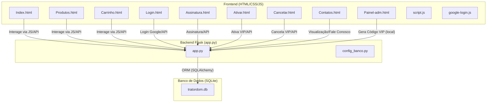
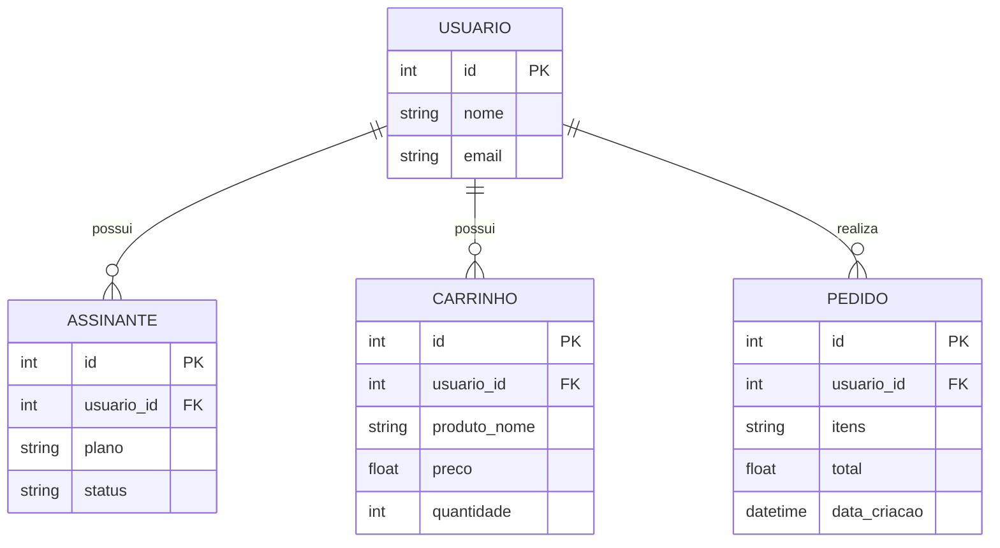
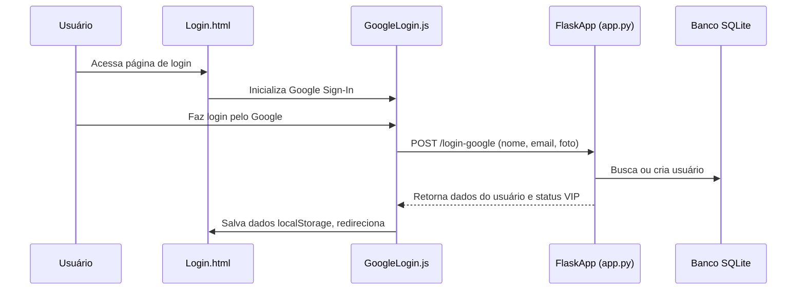
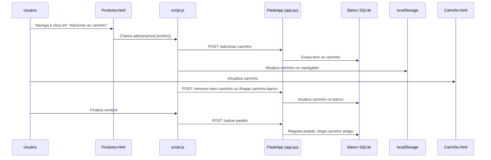
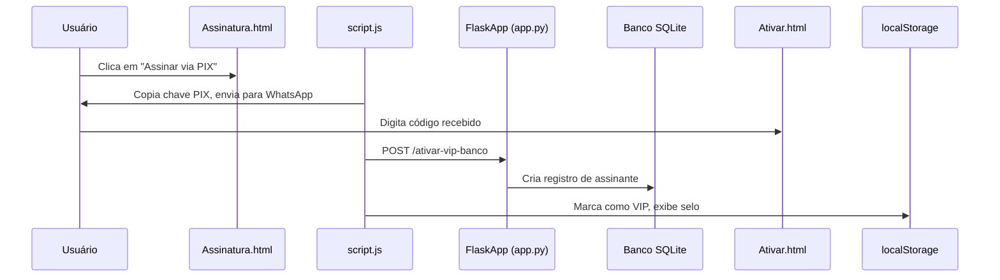

# Tratordom — Documentação Completa do Sistema

## Visão Geral

O **Tratordom** é uma plataforma de e-commerce agrícola que oferece catálogo de produtos, sistema de carrinho de compras, assinatura VIP, login via Google e integração com banco de dados. É um sistema pensado para facilitar o acesso a sementes, ferramentas e insumos agrícolas, com foco em experiência do usuário, automação de vendas e atendimento digital. Todo o frontend é construído com **HTML5**, **CSS3** e **JavaScript** moderno, enquanto o backend utiliza **Python (Flask)** e banco de dados **SQLite**.

---

## Arquitetura do Sistema

O Tratordom é estruturado em camadas, separando apresentação, lógica de negócio e acesso a dados. Abaixo, um diagrama de arquitetura resumido, mostrando a interação entre frontend, backend e banco de dados:



---

## Estrutura dos Componentes

### Camada de Apresentação (Frontend)

- **HTML:** Estrutura cada página (produtos, carrinho, login, assinatura, contatos etc.).
- **CSS:** Temas (style.css), layouts (produtos.css, carrinho.css etc.) e responsividade.
- **JavaScript:** Interação do usuário, carrinho, login Google, assinatura via PIX, gerenciamento de sessão e integração com API.

### Camada de Lógica (Backend)

- **Flask (app.py):** Gerencia rotas, renderiza páginas, expõe APIs REST para login, carrinho, assinatura e pedidos.
- **Configuração ORM (config_banco.py):** Define modelos de dados para usuários, assinantes, carrinho e pedidos.
- **Banco de Dados (tratordom.db):** Armazena persistentemente usuários, assinaturas, itens do carrinho e pedidos.

---

## Modelos de Dados

### Estrutura das Tabelas (SQLite)



#### Tabelas e Campos

| Tabela      | Campos                                                                                  |
|-------------|----------------------------------------------------------------------------------------|
| usuario     | id (PK), nome, email (único)                                                           |
| assinante   | id (PK), usuario_id (FK), plano (Vip), status (Ativo)                                  |
| carrinho    | id (PK), usuario_id (FK), produto_nome, preco, quantidade                              |
| pedido      | id (PK), usuario_id (FK), itens (string), total (float), data_criacao (datetime)       |

---

## Fluxos de Funcionalidade

### Fluxo de Login Google



---

### Fluxo de Carrinho



---

### Fluxo de Assinatura VIP



---

## API — Endpoints Detalhados

### Login com Google (POST /login-google)

#### Endpoint: Login Google

```api
{
    "title": "Login Google",
    "description": "Registra/login do usuário pelo Google. Retorna ID e status VIP.",
    "method": "POST",
    "baseUrl": "http://localhost:5000",
    "endpoint": "/login-google",
    "headers": [
        { "key": "Content-Type", "value": "application/json", "required": true }
    ],
    "bodyType": "json",
    "requestBody": "{\n  \"nome\": \"João Silva\",\n  \"email\": \"joao@exemplo.com\",\n  \"foto\": \"url_da_foto\"\n}",
    "responses": {
        "200": {
            "description": "Usuário cadastrado/logado com sucesso",
            "body": "{\n  \"id\": 1,\n  \"nome\": \"João Silva\",\n  \"email\": \"joao@exemplo.com\",\n  \"status_vip\": false\n}"
        }
    }
}
```

---

### Adicionar Produto ao Carrinho (POST /adicionar-carrinho)

#### Endpoint: Adicionar ao Carrinho

```api
{
    "title": "Adicionar ao Carrinho",
    "description": "Adiciona um produto ao carrinho do usuário no banco de dados.",
    "method": "POST",
    "baseUrl": "http://localhost:5000",
    "endpoint": "/adicionar-carrinho",
    "headers": [
        { "key": "Content-Type", "value": "application/json", "required": true }
    ],
    "bodyType": "json",
    "requestBody": "{\n  \"usuario_id\": 1,\n  \"produto_nome\": \"Trator\",\n  \"preco\": 115500\n}",
    "responses": {
        "200": {
            "description": "Produto adicionado com sucesso",
            "body": "{ \"status\": \"sucesso\" }"
        }
    }
}
```

---

### Remover Item do Carrinho (POST /remover-item-carrinho)

#### Endpoint: Remover Item do Carrinho

```api
{
    "title": "Remover Item do Carrinho",
    "description": "Remove um item do carrinho do usuário no banco de dados.",
    "method": "POST",
    "baseUrl": "http://localhost:5000",
    "endpoint": "/remover-item-carrinho",
    "headers": [
        { "key": "Content-Type", "value": "application/json", "required": true }
    ],
    "bodyType": "json",
    "requestBody": "{\n  \"usuario_id\": 1,\n  \"produto_nome\": \"Trator\"\n}",
    "responses": {
        "200": {
            "description": "Item removido do banco",
            "body": "{ \"status\": \"sucesso\", \"mensagem\": \"Item removido do banco\" }"
        },
        "404": {
            "description": "Item não encontrado",
            "body": "{ \"status\": \"erro\", \"mensagem\": \"Item não encontrado\" }"
        }
    }
}
```

---

### Limpar Carrinho (POST /limpar-carrinho-banco)

#### Endpoint: Limpar Carrinho

```api
{
    "title": "Limpar Carrinho",
    "description": "Remove todos os itens do carrinho do usuário no banco.",
    "method": "POST",
    "baseUrl": "http://localhost:5000",
    "endpoint": "/limpar-carrinho-banco",
    "headers": [
        { "key": "Content-Type", "value": "application/json", "required": true }
    ],
    "bodyType": "json",
    "requestBody": "{\n  \"usuario_id\": 1\n}",
    "responses": {
        "200": {
            "description": "Carrinho limpo no banco",
            "body": "{ \"status\": \"sucesso\", \"mensagem\": \"Banco de dados limpo\" }"
        },
        "400": {
            "description": "Usuário não identificado",
            "body": "{ \"status\": \"erro\", \"mensagem\": \"Usuário não identificado\" }"
        }
    }
}
```

---

### Salvar Pedido (POST /salvar-pedido)

#### Endpoint: Salvar Pedido

```api
{
    "title": "Salvar Pedido",
    "description": "Registra o pedido do usuário e apaga pedidos com mais de 30 dias.",
    "method": "POST",
    "baseUrl": "http://localhost:5000",
    "endpoint": "/salvar-pedido",
    "headers": [
        { "key": "Content-Type", "value": "application/json", "required": true }
    ],
    "bodyType": "json",
    "requestBody": "{\n  \"usuario_id\": 1,\n  \"itens\": \"Trator, Sementes de Milho\",\n  \"total\": 115520.0\n}",
    "responses": {
        "200": {
            "description": "Pedido salvo com sucesso",
            "body": "{ \"status\": \"sucesso\", \"mensagem\": \"Pedido guardado por 30 dias\" }"
        }
    }
}
```

---

### Ativar VIP no Banco (POST /ativar-vip-banco)

#### Endpoint: Ativar VIP

```api
{
    "title": "Ativar VIP",
    "description": "Registra o usuário como assinante VIP no banco de dados.",
    "method": "POST",
    "baseUrl": "http://localhost:5000",
    "endpoint": "/ativar-vip-banco",
    "headers": [
        { "key": "Content-Type", "value": "application/json", "required": true }
    ],
    "bodyType": "json",
    "requestBody": "{\n  \"usuario_id\": 1\n}",
    "responses": {
        "200": {
            "description": "VIP ativado ou já era VIP",
            "body": "{ \"status\": \"sucesso\", \"mensagem\": \"Agora você é VIP no banco!\" }"
        }
    }
}
```

---

### Cancelar Assinatura VIP (POST /executar-cancelamento)

#### Endpoint: Cancelar Assinatura VIP

```api
{
    "title": "Cancelar Assinatura VIP",
    "description": "Remove o registro de assinatura VIP do usuário.",
    "method": "POST",
    "baseUrl": "http://localhost:5000",
    "endpoint": "/executar-cancelamento",
    "headers": [
        { "key": "Content-Type", "value": "application/json", "required": true }
    ],
    "bodyType": "json",
    "requestBody": "{\n  \"email\": \"joao@exemplo.com\"\n}",
    "responses": {
        "200": {
            "description": "Assinatura removida",
            "body": "{ \"status\": \"sucesso\", \"mensagem\": \"Assinatura removida!\" }"
        },
        "404": {
            "description": "Assinatura não encontrada",
            "body": "{ \"status\": \"erro\", \"mensagem\": \"Assinatura não encontrada\" }"
        }
    }
}
```

---

### Puxar Dados do Usuário (POST /puxar-dados-usuario)

#### Endpoint: Puxar Dados do Usuário

```api
{
    "title": "Puxar Dados do Usuário",
    "description": "Obtém status VIP e lista de itens do carrinho do usuário.",
    "method": "POST",
    "baseUrl": "http://localhost:5000",
    "endpoint": "/puxar-dados-usuario",
    "headers": [
        { "key": "Content-Type", "value": "application/json", "required": true }
    ],
    "bodyType": "json",
    "requestBody": "{\n  \"email\": \"joao@exemplo.com\",\n  \"nome\": \"João Silva\"\n}",
    "responses": {
        "200": {
            "description": "Dados sincronizados",
            "body": "{\n  \"usuario_id\": 1,\n  \"is_vip\": false,\n  \"carrinho\": [ { \"nome\": \"Trator\", \"preco\": 115500 } ]\n}"
        }
    }
}
```

---

### Verificar Status VIP (GET /verificar-vip/<usuario_id>)

#### Endpoint: Verificar Status VIP

```api
{
    "title": "Verificar Status VIP",
    "description": "Confirma se o usuário é VIP.",
    "method": "GET",
    "baseUrl": "http://localhost:5000",
    "endpoint": "/verificar-vip/1",
    "headers": [],
    "bodyType": "none",
    "responses": {
        "200": {
            "description": "Status VIP retornado",
            "body": "{ \"is_vip\": false }"
        }
    }
}
```

---

## Frontend: Funcionalidades das Páginas

### Produtos (produtos.html)

- Exibe catálogo com imagem, nome e preço.
- Botão "Adicionar ao carrinho" chama função JS e integra com backend.
- Usa grid responsivo (produtos.css).

### Carrinho (carrinho.html)

- Mostra itens adicionados, total, botões de limpar, remover itens e finalizar compra.
- Finalização envolve cópia automática de chave PIX, registro de pedido e integração com WhatsApp.

### Login (login.html)

- Autenticação via Google.
- Sincronização automática com backend e localStorage.

### Assinatura (assinatura.html) & Ativação (ativar.html)

- Compra via PIX e ativação por código VIP.
- Algoritmo de validação do código com dígito verificador.

### Cancelamento (cancelar.html)

- Exibe status do plano e botão para cancelamento direto via API.

### Painel Administrativo (painel-adm.html)

- Gerador de código VIP com validação local, somente para administradores autenticados por senha.

### Contatos (contatos.html)

- Formulário de contato via Formspree, informações de e-mail, telefone, WhatsApp e localização Google Maps.

---

## Estilos & Experiência Visual

- **Style.css:** Paleta de cores, responsividade, formatação global.
- **Header.css, produtos.css, carrinho.css, assinatura.css, login.css, cancelar.css, contatos.css:** Personalizações específicas por página para header, grid de produtos, carrinho, assinatura, login, cancelamento e contato.

---

## Referência de Classes e Arquivos

| Classe/Arquivo         | Localização              | Responsabilidade                                            |
|-----------------------|-------------------------|------------------------------------------------------------|
| Usuario               | config_banco.py         | Modelo de usuário, base das relações                       |
| Assinante             | config_banco.py         | Registro de status VIP do usuário                          |
| Carrinho              | config_banco.py         | Registro de itens no carrinho por usuário                  |
| Pedido                | config_banco.py         | Registro de pedidos realizados                             |
| app.py                | raiz                    | Backend Flask, rotas HTML e APIs REST                      |
| script.js             | static/script.js        | Lógica de interação (carrinho, assinatura, ativação, etc.) |
| google-login.js       | static/google-login.js  | Integração com Google Login, sincronização local            |
| style.css             | static/style.css        | Tema visual global                                         |
| produtos.css          | static/stylecss/        | Grid e cards de produtos                                   |
| carrinho.css          | static/stylecss/        | Página do carrinho                                         |
| assinatura.css        | static/stylecss/        | Visual do plano VIP e ativação                             |
| login.css             | static/stylecss/        | Visual da tela de login                                    |
| cancelar.css          | static/stylecss/        | Visual da tela de cancelamento                             |
| contatos.css          | static/stylecss/        | Visual da tela de contatos                                 |
| tratordom.db          | raiz                    | Banco de dados SQLite3                                     |

---

## Observações Importantes

```card
{
    "title": "Persistência e Sincronização",
    "content": "O sistema sincroniza dados de sessão (localStorage) e banco de dados constantemente, mantendo experiência consistente ao usuário."
}
```

```card
{
    "title": "Segurança Painel ADM",
    "content": "O painel-adm.html é protegido por senha local, mas deve ser acessado somente por administradores confiáveis."
}
```

```card
{
    "title": "Código VIP",
    "content": "A ativação VIP usa algoritmo próprio de validação com dígito verificador, garantindo autenticidade do código."
}
```

---

## Estratégias de Estado e Sessão

- **localStorage:** Guarda carrinho, usuário Google, status de assinante VIP.
- **Sincronização Backend:** Sempre que possível, os dados do frontend são atualizados no backend para consistência multi-dispositivo.
- **Notificações:** Função `mostrarNotificacao` exibe feedback visual para as principais ações do usuário.

---

## Considerações sobre Testes

- Testar login Google em diferentes navegadores.
- Adicionar e remover itens do carrinho repetidamente.
- Validar fluxo de assinatura VIP (compra, ativação, cancelamento).
- Realizar pedidos e checar persistência de pedidos antigos (limpeza automática após 30 dias).

---

## Dependências Externas

- **Google Sign-In** (OAuth2): Login social prático.
- **Flask + Flask_SQLAlchemy**: Backend para APIs REST e integração ORM.
- **Formspree:** Gerenciamento de envio de formulários de contato sem backend próprio.

---

## Conclusão

O Tratordom une a praticidade do e-commerce moderno com o universo do agronegócio, utilizando tecnologia web 100% aberta, responsiva e de fácil manutenção, garantindo robustez no backend e experiência fluida no frontend.